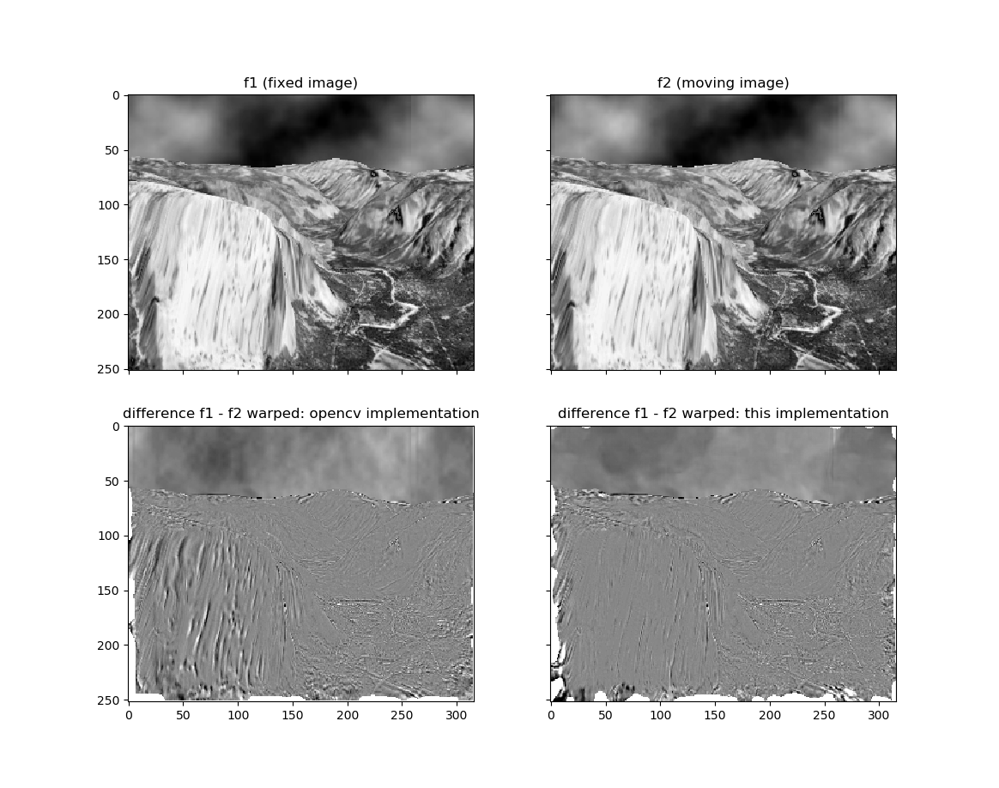

# optical-flow

Pure python implementation of Gunnar Farneback's optical flow algorithm

The `flow_iterative` function is the implementation of the algorithm.
The `poly_exp` function fits each window of an image to a 2nd order
2D polynomial. Both functions make use of a gaussian applicability
window in order to use separable normalized convolution. This also
allows for certainty to be included as an input to the algorithm.

The optical flow method implements an optional affine or projective
regularization as described by Farneback. Without the regularization,
pixels with low certainty (especially those near edges) tend to have
large errors, but the regularization may negatively impact the ability
to model local optical flow in the images.

## Comparing to OpenCV

OpenCV implements a similar algorithm described by Farneback. The
included script calculates the optical flow on frames from the
"Yosemite" sequence using opencv and this algorithm. To install an
environment for running this script, use conda:

```bash
conda env create -f test-environment.yml
conda activate optical-flow

python compare_to_opencv.py
```

In the script, there are two different options for running the
algorithm. The first does not regularize the output with a warp
parametrization, and the second uses a projective warp regularization.
By switching between the options, you can see the differences in the
quality of the warp at the edges and at certain interior points
with local flow fields.

### No Regularization



### Projective Regularization

